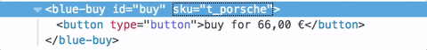

> 翻译文章，原文[在此](https://micro-frontends.org/)，作者Michael Geers.

## 微前端：把微服务的概念扩展到前端开发

简介：微前端是这样的技术，在多个团队协作构建一个现代化的web应用过程中，它能够将这些应用的特性划分开来，独立开发。

### 什么是微前端？

微前端这个术语最早出现在2016年的[ThoughtWorks Technology Radar](https://www.thoughtworks.com/radar/techniques/micro-frontends)。它把微服务的概念扩展到了前端领域。这个技术的趋势是把功能丰富的单页应用架设到微服务架构上。在以前的前端开发中，通常拆分出一个独立的团队来开发和维护页面，随着页面功能增长，工程也变得越来越难以维护，我们称这种现象为[Frontend Monolith](https://www.youtube.com/watch?v=pU1gXA0rfwc)（前端整体，一个应用就一个团队来开发和维护，应用越变越大）。而微前端的概念基于这样的想法，把页面看成是不同功能的组合，而这些功能可能来自不同的团队。每个团队有自己专门研究的业务方向，每个团队都是跨端运行，开发从数据库到用户界面的特性功能。

但是微前端不是新的概念了。它和[Self-contained Systems](http://scs-architecture.org/)（自包含） 的概念相似。又像在过去概念中的[Frontend Integration for Verticalised Systems](https://dev.otto.de/2014/07/29/scaling-with-microservices-and-vertical-decomposition/)（垂直系统前端集成）。但是就算这样，微前端也是一个更友好、更轻量化的概念。

**Monolithic Frontends**（单一前端）

> 译者注：下图显示了当前前端开发的三个阶段：整体开发、前后端分离、微服务


**Organisation in Verticals**（垂直组织）

> 译者注：采用为前端的端到端团队协作开发方式


### 什么才算是现代化的web应用？

在`简介`中我提到了一个概念`构建现代化的web应用`，所以我们先来定义与该概念相关的一些假设。

为了把这个概念放到更宽广的视野内，[Aral Balkan](https://ar.al/)在博客中写了一篇文章，叫[Documents‐to‐Applications Continuum](https://ar.al/notes/the-documents-to-applications-continuum/)（文档到应用的连续性），文章中，他提出了滑动比例的概念。

在一个网站中，由静态文档加链接的方式构成左边部分，右边则由纯粹行为驱动的无内容应用构成，比如一个在线的图片编辑器。

如果你把你的应用放在左侧，那么做一个服务器级别的持续集成是种好的模式(**服务端渲染**)。这种模式下，服务器从所有组件中获取字符串并拼接成HTML字符来组成一个页面请求的响应返回给用户。通过重新从服务器加载页面或者用ajax获取部分页面来完成页面更新。 [Gustaf Nilsson Kotte](https://twitter.com/gustaf_nk/) 写了一篇文章- [comprehensive article](https://gustafnk.github.io/microservice-websites/) 来解释这种模式。

当你的用户界面必须**即时**对用户行为做出**反馈**时，即使在不可靠的连接上，纯服务端渲染模式的站点也不能满足你了。为了实现[Optimistic UI](https://www.smashingmagazine.com/2016/11/true-lies-of-optimistic-user-interfaces/)（乐观界面）或者[Skeleton Screens](http://www.lukew.com/ff/entry.asp?1797) （骨架屏）技术，你需要让应用能够在用户端**自己更新自己**。Google推出的 [Progressive Web Apps](https://developers.google.com/web/progressive-web-apps/) (渐进式web应用)的概念，恰到好处地**平衡**了web的渐进增强特性和原生应用性能的体验。这种应用介于web应用和原声应用之间，在此，完全的服务端渲染方案已经不再适用了，我们必须在**浏览器中集成**，这就是本文所关注的问题。

### 微前端背后的核心观念

* **Be Technology Agnostic**不必关注(组件或应用)实现细节

  每个团队能够自己选择和升级他们的技术栈，并不需要和其他团队协同工作。[Custom Elements](https://micro-frontends.org/#the-dom-is-the-api)（自定义元素）是一种隐藏实现细节并提供中性接口的好方法。

* **Isolate Team Code**隔离团队代码

  不要共用同一个运行环境，即使所有的团队都在用同样的框架，应该构建一个自包含的独立应用，保证独立应用不依赖共享的状态或者全局变量。

* **solate Team Code**设立团队前缀

  团队间应该在无法隔离时使用各自的命名约定，命名空间的CSS、事件、本地存储、Cookie等应该避免冲突，应澄清各自团队的命名空间。

* **Favor Native Browser Features over Custom APIs**通过客户端API来支持本地浏览器特性

  使用[Browser Events for communication](https://micro-frontends.org/#parent-child-communication--dom-modification)（浏览器通信事件），不要用全局的订阅-发布系统，如果你不得不构建一个跨团队的API，应该尽量让它简化。

* **Build a Resilient Site**弹性十足的网站

  即使js出错或者没有被执行到，你的应用特性也应该能用。你可以使用[Universal Rendering](https://micro-frontends.org/#serverside-rendering--universal-rendering)（通用渲染）和渐进增强来提升应用被感知到的性能。

### DOM就是你要的API

[Custom Elements](https://developers.google.com/web/fundamentals/getting-started/primers/customelements)（自定义元素）是已经集成到浏览器中的web组件交互规范。每个团队可以**选择自己的技术来构建组件**，最后把组件包裹到**自定义组件**中，这个DOM元素组件可以被其他团队引用或者作为一个公共的API。这带来的好处就是所有人可以用这个组件和它提供的功能，又不用关心它的实现细节。使用者只需要能够操作并应用这些DOM组件做交互就行了。

但是单独使用自定义组件并不能解决我们所有的问题，为了解决渐进增强、通用渲染或者路由的问题，我们需要一些额外的软件来协助。

以下文章将分为两个部分。第一个部分，我们讨论[Page Composition](https://micro-frontends.org/#page-composition)（页面组成）-如何从不同的团队构建的组件中编译出页面。第二个部分，我们将展示一些实现了客户端 [Page Transition](https://micro-frontends.org/#page-transition)（页面过渡）的例子。

### 页面组成

除了在**不同框架下编写出来的客户端和服务端**本身之外，我们还有很多方面需要讨论：**js隔离机制**、**css冲突避免机制**、**按需加载**资源、团队间**共享资源**、数据**获取**的处理，以及对用户良好的**加载状态**。我们将一个个讨论这些主题。

### The Base Prototype基础原型

这个模型拖拉机的页面将提供以下示例的基础服务。

它提供**类型选择**器以在三种不同型号之间做切换，在切换过程中，产品的图片、名称、价格和建议会得到相应的更新。另外还有一个**购买按钮**，可以把当前选中的型号加到购物车内，头部的**小购物车**状态将得到更新。


[try in browser](https://micro-frontends.org/0-model-store/) & [inspect the code](https://github.com/neuland/micro-frontends/tree/master/0-model-store)

所有的HTML都是用**纯js**和es6的模板字符串生成的，**没有依赖**。代码用了一个简单的状态/标记分离方式，在每次有变化时重新渲染HTML客户端，没有花哨的DOM差异，现在也**没有通用的渲染**。并且没有**团队分割**，[the code](https://github.com/neuland/micro-frontends/tree/master/0-model-store)是放在一个js/css文件内的。

### Clientside Integration客户端集成

在这个例子中，页面被分割成三个团队负责的组件/片段。**Team Checkout**(蓝色)负责所有购买流程的任务-**购买按钮**和**迷你购物车**。**Team Inspire**（绿色）负责产品建议。**Team Product**（红色）整个产品页面布局。


> 译者注：从图上看出来，不同的部分可能用不同的技术来实现。

[try in browser](https://micro-frontends.org/1-composition-client-only/) & [inspect the code](https://github.com/neuland/micro-frontends/tree/master/1-composition-client-only)

**Team Product**决定哪些功能将被包含进来、各个功能被放到哪个位置。页面本身所包含的信息可以用**Team Product**提供，比如产品名称、图片、可选种类。但是它也包含了一些其他团队开发的自定义元素。

#### How to Create a Custom Element?如何创建一个自定义元素

让我们选**购买按钮**作为一个例子，**Team Product **简单地通过把`<blue-buy sku="t_porsche"></blue-buy>`加到相应标签位置引入按钮。为了这种引用操作，**Team Checkout**必须在页面内注册`blue-buy`。

```javascript
class BlueBuy extends HTMLElement {
  constructor() {
    super();
    this.innerHTML = `<button type="button">buy for 66,00 €</button>`;
  }
  disconnectedCallback() { ... }
}
window.customElements.define('blue-buy', BlueBuy);
```

注册好后，每次浏览器遇到一个新的`blue-buy`标签，构造函数就会被调用。`this`指向你定义的自定义元素的根结点，所有符合标准DOM元素的属性和方法都可以被调用，比如`innerHTML`和`getAttribute()`。


为了兼容那些接下来的新的HTML标签，元素命名唯一的规范性要求就是名字必须包含**短横(dash)`-`**。在接下来的示例中，我们用的命名规范为`[team_color]-[feature]`。命名空间的方式可以避免冲突，并且简单地看一下DOM结构就可以清楚地知道这个特性是哪个团队负责的。

### Parent-Child Communication / DOM Modification父子组件通信/DOM修改

当用在**类型选择**内选择另一个拖拉机时，**购买按钮**必须依此更新。为了达到这个目标，**Team Product**可以简单地**移除**已存在的DOM元素，然后**插入**一个新的。

```javascript
container.innerHTML;
// => <blue-buy sku="t_porsche">...</blue-buy>
container.innerHTML = '<blue-buy sku="t_fendt"></blue-buy>';
```

旧元素的`disconnectedCallback`方法，会在新创建的`t_fendt`元素的`constructor（构造函数）被调用后同步调用，以提供一个清除资源的机会，比如在这里清除事件监听。

另一种高性能的方法是只更新已存在元素的`sku`属性。

```javascript
document.querySelector('blue-buy').setAttribute('sku', 't_fendt');
```

如果**Team Product**使用了提供DOM diff特性的模板引擎，比如React， 那这种替换将被算法自动处理。



为了支持这种特性，自定义元素可以实现`attributeChangedCallback`方法并指定一些能够触发此回调的属性`observedAttributes`。

```javascript
const prices = {
  t_porsche: '66,00 €',
  t_fendt: '54,00 €',
  t_eicher: '58,00 €',
};

class BlueBuy extends HTMLElement {
  // 指定可观察属性，这些属性变动后会触发attributeChangedCallback方法
  static get observedAttributes() {
    return ['sku'];
  }
  // 元素创建时调用。初始化
  constructor() {
    super();
    // 初始化渲染
    this.render();
  }
  // 渲染
  render() {
    const sku = this.getAttribute('sku');
    const price = prices[sku];
    this.innerHTML = `<button type="button">buy for ${price}</button>`;
  }
  // 属性变动回调
  attributeChangedCallback(attr, oldValue, newValue) {
    // 重新渲染
    this.render();
  }
  // 元素被销毁前，由浏览器调用
  disconnectedCallback() {...}
}
// 定义自定义元素
window.customElements.define('blue-buy', BlueBuy);
```

为了避免重复写代码，我们引入了一个`render`方法，它可以在`constructor`和`attributeChangeCallback`调用。这个方法搜集所需的数据、生成新的innerHTML。当你考虑在自定义元素内部使用复杂的模板引擎或者框架时，render就是写相关初始化代码的地方。

#### Browser Support浏览器支持

上面的示例采用自定义元素的V1版本的规范，受到[supported in Chrome, Safari and Opera](http://caniuse.com/#feat=custom-elementsv1)支持。但是用[document-register-element](https://github.com/WebReflection/document-register-element) ，可以有一种轻量级的经过实践测试的polyfill，让这个例子在所有浏览器中跑成功。`document-register-element`采用了广受支持([widely supported](http://caniuse.com/#feat=mutationobserver) )的`Mutation Observer API，所以底层没有用DOM树方式检查程序运行状态。

#### Framework Compatibility框架兼容性

自定义元素是一个web标准，主要的js框架(Angular、React、Preact、Vue、Hyperapp)都支持。但当你深入了解的话， 在一些框架上还存在少量实现问题。[Custom Elements Everywhere](https://custom-elements-everywhere.com/) [Rob Dodson](https://twitter.com/rob_dodson)这篇文章讲了一些兼容性测试，未解决的问题被高亮标明了。

#### Child-Parent or Siblings Communication / DOM Events父子组件通信、兄弟组件通信/DOM事件

传递属性不是对所有的交互都那么有效。在我们的示例中，**迷你购物车需要在用户点击购买按钮时得到刷新**。这两个片段都被**Team Checkout (blue)**持有，所以他们能够构建一些内部的js API来让迷你购物车知道按钮被点击了；但是这种方法让两个组件实例都要知道对方的方法，显然违背了独立分离的原则。

一个简单的方法是使用事件总线（PubSub），这样一个组件可以发布一个事件，其他的组件可以订阅这个事件主题。幸运的是浏览器已经集成了这个特性，像`click`、`select`或者`mouseover`这些事件就是这么生效的。除了利用浏览器本身事件外，还可以使用`new CustomEvent()`来创建更高级的事件。事件总是绑定在创建/分发它的元素上，大多数原生事件都有冒泡的特性，这让我们能够在元素上监听子DOM树上的事件。如果你想监听页面上所有的事件，就把监听事件放到`window`上就可以了。这里我示例了如何使用`blue:basket:changed`事件：

```javascript
class BlueBuy extends HTMLElement {
  [...]
  connectedCallback() {
    [...]
    this.render();
    this.firstChild.addEventListener('click', this.addToCart);
  }
  addToCart() {
    // maybe talk to an api
    this.dispatchEvent(new CustomEvent('blue:basket:changed', {
      bubbles: true,
    }));
  }
  render() {
    this.innerHTML = `<button type="button">buy</button>`;
  }
  disconnectedCallback() {
    this.firstChild.removeEventListener('click', this.addToCart);
  }
}
```

迷你购物车可以在`window`上订阅这个事件，当它应该更新的时候，会得到对应的通知。

```javascript
class BlueBasket extends HTMLElement {
  connectedCallback() {
    [...]
    window.addEventListener('blue:basket:changed', this.refresh);
  }
  refresh() {
    // fetch new data and render it
  }
  disconnectedCallback() {
    window.removeEventListener('blue:basket:changed', this.refresh);
  }
}
```

在这段迷你购物车的片段中，它在内部添加了外部DOM的监听事件。很多应用场景，这都是ok的，但如果你觉得这么做不好，你可以实现一个页面本身(**Team Product**)的事件监听和通知发布机制，当需要更新的时候在**Team Product**中调用`refresh()`来通知迷你购物车。

```javascript
// page.js
const $ = document.getElementsByTagName;

$('blue-buy')[0].addEventListener('blue:basket:changed', function() {
  // 直接调用购物车的refresh方法
  $('blue-basket')[0].refresh();
});
```

命令式地调用DOM方法是非常罕见的，但在这个视频([video element api](https://developer.mozilla.org/de/docs/Web/HTML/Using_HTML5_audio_and_video#Controlling_media_playback) )中能找到示例。如果可能应优先使用声明式的方式。

## Serverside Rendering / Universal Rendering服务端渲染/通用渲染

在浏览器中用自定义元素的方式集成组件是很棒的，但是当我们是在构建一个网络上的web应用时，最重要的是首次加载的性能，在js框架加载和执行完之前，用户将面对一个白屏的页面。另外，要考虑到js加载失败或者阻塞的情况。[Jeremy Keith](https://adactio.com/)在[Resilient Web Design](https://resilientwebdesign.com/)中解释了这个重要性。因此在服务端渲染核心内容是一个关键能力。悲催的是web组件标准没有聊到服务端渲染的内容。没有js，没有自定义元素😢。

### Custom Elements + Server Side Includes = ❤️自定义元素+服务端渲染=🐂🍺

为了提供有效的服务端渲染，前面的示例需要重写一下。每个团队将有他们自己的express服务，并且自定义元素的`reander()`方法可以通过url得到。

```base
$ curl http://127.0.0.1:3000/blue-buy?sku=t_porsche
<button type="button">buy for 66,00 €</button>
```

使用自定义元素的标签名作为路径名称，属性成为query参数。现在就可以给任意内容做服务端渲染了。结合`<blue-buy>`和自定义元素，就很接近通用渲染组件了：

```html
<blue-buy sku="t_porsche">
  <!--#include virtual="/blue-buy?sku=t_porsche" -->
</blue-buy>
```

`#include`是服务端渲染include([Server Side Includes](https://en.wikipedia.org/wiki/Server_Side_Includes))的一部分，很多web服务器都支持这种特性。是的，这个技术和以前用的那种嵌套技术是一样的，并被用在了我们今天的网站上。另外也有很多可选的其他技术，比如：[ESI](https://en.wikipedia.org/wiki/Edge_Side_Includes), [nodesi](https://github.com/Schibsted-Tech-Polska/nodesi), [compoxure](https://github.com/tes/compoxure) 和 [tailor](https://github.com/zalando/tailor)。但是我们项目的服务端渲染已经证明了这种方案是简单有效的了。

`#include`会在服务端向浏览器发送整个页面之前被`/blue-buy?sku=t_porsche`替换掉。`nginx`对应的配置为：

```nginx
upstream team_blue {
  server team_blue:3001;
}
upstream team_green {
  server team_green:3002;
}
upstream team_red {
  server team_red:3003;
}

server {
  listen 3000;
  ssi on;

  location /blue {
    proxy_pass  http://team_blue;
  }
  location /green {
    proxy_pass  http://team_green;
  }
  location /red {
    proxy_pass  http://team_red;
  }
  location / {
    proxy_pass  http://team_red;
  }
}
```

直接`ssi:on`，开启服务端渲染功能，`upstream`和`location`块会被加载来为每个团队服务，以确保所有`/blue`开头的url都会被路由到正确的应用(`team_blue:3001`)。`/`被路由到**Team Product**（red）。

以下动画展示了**禁用js**后的拖拉机商店(浏览器中)：

> 译者注：翻译到这里，我震惊了


[inspect the code](https://github.com/neuland/micro-frontends/tree/master/2-composition-universal)

类型选择按钮现在实际上是链接了，每个点击都将被链接到新加载的页面中。右边的终端展示了一个请求是如何被路由到**Team Product**（red）的，而rea控制页面的布局和展示，red加载完成之后，内部的标记将由blue和green补充。

当切换回js enable的状态，就只会有第一个请求日志会展示出来(只会发生第一个请求)，因为随后的所有拖拉机变化之类的操作都在客户端解决了(js)。这个例子中产品数据会额外地用REST api来从后端加载。

你可以在本地运行这些简单的代码，只需要装个docker([Docker Compose](https://docs.docker.com/compose/install/))。

```bash
git clone https://github.com/neuland/micro-frontends.git
cd micro-frontends/2-composition-universal
docker-compose up --build
```

Docker启动nginx，端口为3000，docker也可以为所有团队构建node.js镜像。当你打开`http://127.0.0.1:300/`，你应该能够看到一个红色拖拉机。结合`docker-compose`插件可以清楚地知道网络上发生了什么。悲催的是，没办法控制输出的颜色，所以你得忍受blue可能被高亮成了green。

`src`文件映射到单独的容器中，node应用会在你更新代码后重启，改变`nginx.conf`需要重启`docker-compse`以获得新的特性。那么，尽情享用吧，期待得到反馈。

#### Data Fetching & Loading States数据获取和状态加载

SSI/ESI方法的一个缺点是**最慢的片段决定了最终页面的响应时间**。所以要是能获取到一个片段的响应时间是很好的，对那些很难产生和缓存的片段来说，一个好的方法就是把他们包括到最初的渲染里面，他们可以被浏览器异步加载。在我们的示例中，`green-recos`片段(用来渲染个性化建议的)是一个好的例子。

一种可能的方式就是red跳过服务端渲染。

##### Before

```html
<green-recos sku="t_porsche">
  <!--#include virtual="/green-recos?sku=t_porsche" -->
</green-recos>
```

##### **After**

```html
<green-recos sku="t_porsche"></green-recos>
```

重要的一点：自定义元素无法自关闭(*cannot be self-closing*)，因此写成`<green-recos sku="t_porsche" />`不会生效。


渲染只发生在浏览器，但是，在动画中可以看到，这一变化给页面带来了大量的**重排**。建议区域一开始是白屏的，然后green的js加载和执行了，然后执行API获取建议数据，最后建议数据的标签在请求完成后才渲染好，并关联到对应图片上。这个片段现在需要更多的空间，并且挤压了布局。

有几种不同的方法可以避免这种重排。red可以**固定容器高度**，在一个响应式页面中，这种方法是不可取的，因为没法根据设备调整布局大小。但是更重要的问题是，这种方法会在red和green团队之间形成**紧密联系**，这是不可取的。

一个更好的方法是使用骨架屏方案[Skeleton Screens](https://blog.prototypr.io/luke-wroblewski-introduced-skeleton-screens-in-2013-through-his-work-on-the-polar-app-later-fd1d32a6a8e7)。red团队留下green团队的服务端渲染标记，green团队修改他们服务端渲染的方法，以便生成骨架屏。骨架屏可以重复使用占用实际标签的位置，以页面免产生跳跃的情况。


骨架屏在客户端渲染中也是很重要的。当你的自定义元素根据用户操作要插入进DOM时，它可以立即渲染骨架，直到数据加载完成后渲染真实节点。

甚至在属性切换时你也可以决定页面切换到骨架屏直到新数据的到来，这样用户就可以从这部分片段正在发生的事中获得指示。但是当你的终端能够快速响应时，很多短时的骨架屏闪烁也是一个烦人的事情，你需要做一些取舍。

### Navigating Between Pages在页面之间跳转

未完待续...