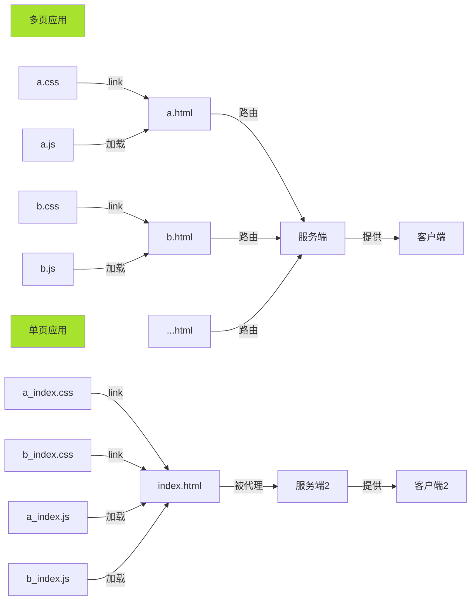

<h1>
    <center>从JavaWeb到Vue</center>
</h1>
<p align="right">by wander</p>

我个人的前端之路是从JavaWeb开始的，现在很多人讲前端发展历程会从web技术的起源开始，讲到浏览器大战，到ajax，到node，到amd、cmd，到webpack，到三大框架...而我只是写了一些JSP，然后到vue+jsp，到vue。当然这是一个很取巧的进化路线，很多内容还需要时间去填补，但这并不妨碍我对web技术的喜爱，希望自己也能从写这个册子的过程中得到进步。Make a little progress per day.

第一篇文章。偏向于整理一些抽象性的东西，详细内容在后面慢慢写。

# 动态的页面

目前主流的网页技术都是基于`HTML\CSS\JAVASCRIPT`的，也就是说，你学会了这三种，也就能写一个网页。

* `HTML`：构造页面的骨架
* `CSS`：添加页面的样式，装饰你的骨架
* `JS`：给你的页面添加控制逻辑，增加【行为】

当然，只有这三种技术，你只能获得一个【静态】的页面，它并没有真正跑起来，也不能从互联网上面访问到。想要让页面真正【运行】起来，就需要【HTTP】相关的知识了。

### HTML

```html
<html lang="en">
<head>
  <meta charset="UTF-8">
  <meta name="viewport" content="width=device-width, initial-scale=1.0">
  <meta http-equiv="X-UA-Compatible" content="ie=edge">
  <title>Document</title>
</head>
<body>
    <nav></nav>
    <header></header>
    <section>
    	<div>
        	    
        </div>
    </section>
    <footer></footer>
</body>
</html>
```


HTML(HTML5，现在学就从这个版本开始就行了)是一种标记语言，大多数【标签】都需要闭合，每个标签有自己的语义。上面的代码片段是一个典型的页面，就像是建筑的骨架一样，构建了你心目中页面的基础样子。

另外还有很多标记语言或是模板语言，都可以搭建一种【描述骨架】，`JSON`也可以用来描述事物。我喜欢把他们叫做【模板】，事实上，我们在现实生活中做事，也是参照了很多【模板】，道德就是一种【模板】，但我们做事的准则又常常和标准的道德有出入。【模板】带给我们做成一件事的基础能力，基于这个能力，我们可以完成更多的事，且做得更好。

基于【模板】我们可以做很多事，HTML的模板和js结合就成就了Vue，当然Vue并不是成名于它的模板语法。我们写JSP其实也算是一种模板语法。如JSP内定义的`<%>out.println()<%>`、`<%@page attribute="value" %>`等，这些语法给静态的骨架，注入了【动态】的能力，经过服务器编译后，它们拿到了属于服务器上的一些属性和方法。

在客户端，我们主要用js和【模板】通信，这就是DOM(Document Object Model)。但是文档操作本身是比较耗费资源的(可以参考后端的文件操作),因此，在原生DOM的基础上，发展了很多其他的技术，来减少这些耗费。

总之，HTML给了我们设计一种事物的基础能力。

### CSS

```css
.header {
    width: 100px;
    height: 200px;
    background: red;
    border: 1px solid black;
}
```

`css`定义了一系列选择器规则和样式规则，我们可以取定义文档元素的宽、高、背景、边框、位置、形状等内容。基础的css并不复杂，但是为了给我们的元素做装饰，【规则】的选取就比较重要了。

* 选择器：每一种选择器都有自己的权重。`!important > inline > id > class | attribute | pseudo class > tag`
* 样式：样式定义要重点区分一些概念, 【定位】【块级作用域】【单位】等。

css可以直接写在style内，也可以被link进来。

css在后期也扩展出了很多增强语法，less、sass都是对他的扩展，写的时候更爽，然后通过编译器编译为css语法。另外还有更面向未来的postcss。

### JS

js是一门动态弱类型的脚本语言，不需要你去定义变量的类型，变量在运行时，类型可以被改变。js在早期是web开发的利器，后来就逐渐占领了市场。

* 编程能力：js里面函数是第一等公民，没有类(es6的class也只是基于原型的语法糖)，提供基于原型的扩展能力。基础的能力都是有的。
* DOM：提供了一系列访问文档的api。window.document、[dom].querySelector、事件等。访问dom的能力让我们能够拿到元素内容、属性、样式，当然也可以去修改。注意cookie也是挂在document下的，`document.cookie`.
* BOM：提供了和浏览器做交互的api。如操作浏览器访问栈`window.history`，操作地址栏`window.location`，操作浏览器信息`window.navigator`,操作窗口`window.screen`，打开TAB`window.open`,以及定时器`setTimeout\setInterval`等等
* 网络编程：提供访问网络资源的能力。访问网络的原生能力`XMLHttpRequest`,也就是ajax。HTML内有了`WebSocket`，都是挂在`window`下面的。网络能力让我们能够异步获取资源并更新我们的文档，让页面更加动态。
* 存储能力：本地存储`window.localStorage`, 会话存储`window.sessionLStorage`，数据库`window.indexedDB`。存储能力出现后，给页面带来了更大的可能。比如状态存储和恢复、数据缓存(比网络更快的获取数据的能力)。
* 绘画能力：`canvas`,`svg`。当然这是`html5`出的内容，但是通过js才带给他们更大的能力。
* 3D能力：`THREE.js` `webgl`

可见，js提供了几乎和服务端语言开发一样的能力，如何组合运用这些能力，才是业务开发中的关键。

### HTTP

访问一个页面，最难以忍受的就是等待。页面耗时的原因很多：

* 浏览器本地解析地址
* 网络传输(距离、数据量、速度)
* 中继(DNS\路由器\分线器)，路由器解析
* 服务端处理
* 浏览器解析结果
* 浏览器渲染(绘制、排列)
* 浏览器脚本执行

...

`HTTP`是一个应用层协议，大部分实现都采用TCP传输。`HTTP`协议本身帮我们解决了这些问题

* 网络通信方式
* 通信数据缓存策略
* 通信错误码

但是HTTP是不可靠的，虽然本身存在三次握手机制，但该机制只限于建立连接，连接劫持的情况却并未被考虑，传输数据在网络上都是透明的。因此后来基于google开发的开放协议SPDY，开发了HTTP2.0，HTTP2.0 几个典型的特点就是

* ssl\tls带来了安全性(加密)，证书机制
* 多路复用
* 帧压缩
* 双向通信
* 流编号，优先级排序

通常情况下，我们用`HTTP1.1`比较多。

`WebSocket`是通信在ws协议上的，通过`http1.1`的`Upgrade`

总之，HTTP给了前端页面质的提升，没有网络访问能力，页面将是一潭死水。

### 页面的访问

当有了上面的基础知识，就可以基于一种web服务器，开发自己的站点了(配合后端)。常用的web服务器有

* apache：多平台、安全性、模块扩展、后台硬、静态网页
* nginx：轻量、反向代理、邮件服务、并发能力强、负载均衡。
* tomcat：动态页面、JavaWeb、重型、安全
* node：V8引擎、非阻塞I/O模型、分布式、密集运算、轻量、并发

采用`node`写服务的时候，需要启动`http`模块，基本原理就是服务器起了一个端口，代理了你的`html`文件，而你的`css`和`js`因为被html页面引用的缘故，也被一同导入了服务器管理。当客户端访问时，就通过http拿到所有文件，然后由浏览器渲染到窗口(viewport)内。



当然，仅仅是页面还是不够的，因此服务端发展出了拦截器、路由(多页)，并且对不同的资源划分了不同的请求路径和资源类型；相应地，前端也存在自己的请求拦截器、路由(单页),等。并可以基于这些工程化的思想，把前端页面分为多个层次。

```mermaid
graph LR
 浏览器 --> 人
 视图 --> 浏览器
 subgraph 
  html --> 视图
  模板 --> 视图
  ... --> 视图
 end
 逻辑 --> 视图
 subgraph 
  数据模型 --> 逻辑
  controller --> 逻辑
  service --> 逻辑
  business1 --> service
  business2 --> service
  business... --> service
  存储 --> 逻辑
 end
 网络 --> 逻辑
 subgraph 
  接口管理层 --> 网络
  请求拦截层 --> 网络
  数据处理层 --> 网络
 end
 服务器 --> 网络
 数据库 --> 服务器
 style 视图 fill:#a6e22e
 style 网络 fill:#a6e22e
 style 逻辑 fill:#a6e22e
 
```

* 视图
  * html：单页应用基本就一个index.html，然后在前端做路由，切换到不同的hash
  * 模板：模板语言最后还是被编译成html的一部分了
* 逻辑
  * 数据模型：包括你的状态管理、基础数据。这个比较关键，基础数据的抽象能力，影响了页面的复杂度。做业务前最好好好做一下基础数据的设计：数据格式、存储位置、数据表现能力。
  * controller：可以抽象出一层controller，搜集页面的不同事件。前端流行用订阅模式、观察者模式来实现这种控制关系。
  * service：在我眼里，业务是属于service的。所有的跟业务相关的内容，都需要放到service里面，一个项目存在多个业务，所以，service也要注意分类。一个service可能提供了处理一个模块多种业务的能力。
  * 存储：这就是前端的数据库了。一般涉及到数据的缓存(减少请求)、状态存储与恢复(离线、上线)、权限信息(多会话访问能力)、图像缓存(大数据量缓存，提高二次访问速度)等。
* 网络
  * 接口管理层：一个大点的项目至少也有几十个接口吧，统一用一个对象去管理他，会提高开发效率，也有利于对接第三方应用。
  * 请求拦截层：数据合法性校验、分权分域、请求\响应头设置、数据预处理、错误处理
  * 数据处理层：不同类型的数据，预处理后再返回给业务层。

一个清晰的层次，是项目可持续发展的重要一环。

最后，经过层层处理，页面被交给浏览器，浏览器进行排列和绘制，就形成了你所见的页面。

# Vue

### 是什么

`vue是一个用于构建用于界面的渐进式框架`。它只关心视图的处理，具有双向绑定能力，其余能力(路由、状态管理等)需要作为增量进行扩展。

###### 模板语言

```vue
<template>
	<div id="vue">
        <input v-model="value"></input>
    </div>
</template>
<script>
new Vue({
    el: '#vue',
    data () {
        return {
            value: 'hello world'
        }
    }
})
</script>
```

模板语言的语法和jsp的语法有很多相似之处，都是在标签内写变量和表达式。如上面这段代码中的`v-model`模板语言会被vue内置的渲染引擎重新编译，在内部进行双向绑定。绑定后的`value`，接受页面输入后，自动反馈给js，同时，js改变`value`后，页面也能够及时响应。

###### 双向绑定

```javascript
Object.defineProperty(obj，prop ，{
    get () {
        // 绑定到dom元素
    }，
    set () {
        // 执行dom元素更新
    }
})
```

上面的逻辑简述了双向绑定实现的逻辑。通过ES5的`Object.defineProperty`这个api，vue劫持了`obj`某些字段的行为，在获取值得时候，从页面获取；在设置值时，同时设置到页面。当然Vue的原理并不是这么简单几句就可以讲述清楚的，它的内部还存在一个依赖收集器`Dep`，用于搜集各个属性、组件的依赖关系；一个观察者`Observer`，用于观察对象属性的改变并通知对象做响应改变。此外还有一个完整得响应处理机制。

###### 组件化开发

Vue可以开发组件。

```html
<!-- 第一种 -->
<div>
	<component name="aComponent" :datas="datas"></component>
    <another-component name="bComponent" :datas="datas" @click="clicked"></another-component>
</div>

<!-- 第二种 -->
<div>
    <div class="component-1">
        do something
    </div>
    <div class="component-2" onclick="func">
        do another thing
    </div>
</div>
```

上面两种开发方式，第一种是我们写【模板】时最希望出现的。因为他可以给我们带来

* 语义：一种能力就是一个组件，而不是需要写一堆`div`去实现这种能力
* 数据绑定：datas可以通过组件【属性】的方式传入，之后外部就不用关心内部实现，只需要通过组件返回的方法来获取状态就行了
* 复用：一个良好的组件，可以被多个项目重用，因此可以构建基于Vue的组件库，提供对业务更好的支撑。
* 封装：组件内部自然是不需要你关心的，业务层只需要完成业务代码就行了。

###### 插件系统

Vue本身只提供响应式的模板功能，主要能力就是双向绑定和模板语法。但是Vue可以提供插件扩展，官方维护的`Vuex` 提供了状态管理能力，`Vue-Router`提供了单页应用前端路由能力。其他的一些优秀的第三方库，也有自己提供的扩展能力，通过这种插件系统，使得Vue能做的事情很多，完全可以满足各种需求。同时这种渐进式的开发方式，让我们的学习曲线比较平滑，也为Vue的普及带来了便利。

###### 指令系统

Vue内置了一些指令，如`v-if` `v-model`等，但Vue还支持自定义指令，这给我们定制自己的组件库，提供了很多可能。比如通过指令，减少直接的dom操作，直接生成遮罩层，`ElementUI`的`v-loading`就是这么实现的。

### 为什么用Vue

其实讲解了是什么之后，自然也就明白了在什么场景下应该选择Vue。下面列一些场景

* 从后端转业到前端。模板语言天生的亲和力，让你可以一天就写出一个Vue页面。
* 响应式开发。如果你不太想完全依赖js的编程能力，那么这种模板+视图模型的开发方式，可以让你体验到快速生成页面的快感。
* 渐进式、生态系统考量。Vue上手简单，社区庞大，学习曲线平滑，渐进式开发，可以给系统带来更多的稳定性。毕竟一个大的框架，如果只会几个api就开始搭建项目，技术总监是不能忍的。

总的来说，Vue的开发体验是很平滑的，api设计也很友好，值得一试。

另外需要讲一讲当前开发Vue常见的一些问题和不爽的地方

* 默认绑定。当你的需要做绑定的数据足够大时，vue为了绑定这个数据，耗费的时间、空间都会增大很多，此时，【双向绑定】这件事就成了双刃剑。因此大数据变量、第三方插件对象不建议作响应式绑定，建议采用Object.freeze()把变量冻结，这样Vue就不会去执行绑定操作。
* 组件通信。一般来讲，父子组件通信采用变量、方法就可以了，或者emit。兄弟组件通信(或跨越多层级进行通信)时，一般会给Vue的跟组件绑定一个EventBus(事件总线),通过事件总线进行通信。当项目被多人进行开发，且开发水平各不相同时，就会出现各种不同水平的通信方式，而且这种事件漫天飞的方式，给快速开发、迭代带来了巨大阻力。
* 原生API。很多人用Vue，就忘了原生api提供的那些能力，有的直接用jq和Vue组合，有的就各种用pollyfill。这点不算是Vue的缺点，只是因为Vue封装得太好，让人少了更多的原生思考。而要进阶到一个真正的工程师，深度思考能力是必不可少的。
* jsx和ts支持。很多人还是需要完全js编程能力的语法的，但是Vue的jsx和ts语法都是本地化的，这对于一些框架切换什么的，存在一些学习和本地化成本。

# 推荐

* HTML：需要学习，至少放一本工具书，遇到问题可以迅速查找。[Head First HTML与CSS](<https://book.douban.com/subject/25752357/>)
* CSS：[css揭秘](<https://book.douban.com/subject/26745943/>)(进阶)
* js：[JavaScript高级程序设计](<https://book.douban.com/subject/10546125/>)、[你不知道的JavaScript](<https://book.douban.com/subject/26333594/>)、[深入理解ES6](<https://book.douban.com/subject/27072230/>)、[JavaScript设计模式与开发实践](<https://book.douban.com/subject/26382780/>)
* vue: [官网](<https://cn.vuejs.org/index.html>)
* http: [图解HTTP](<https://read.douban.com/ebook/12054542/?dcs=subject-rec&dcm=douban&dct=26333594>)